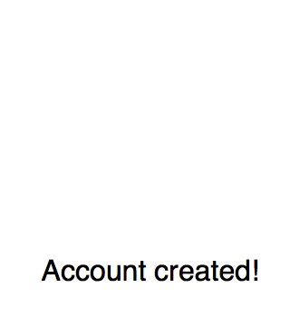

# Success Indicator for React

A simple success indicator for use with React.js

## Installation

```sh
npm install --save react-success-indicator
```

## Usage

```js
const SuccessIndicator = require('react-success-indicator')

// ...

return (
  <div>
    <p>
      <SuccessIndicator size='96px' color='black' />
    </p>

    <p>
      Account created!
    </p>
  </div>
)
```

**Result:**



## Props

### `size`

- optional
- type: `string`

The size of the indicator. Can be specified as any css-compatible length.

e.g. `'100%'`, `'128px'`, `'1em'`

### `color`

- optional
- type: `string`

The color of the indicator. Can be specificed as any css-compatible color.

e.g. `'black'`, `'#fc3'`, `'rgb(128, 64, 192)'`, `'#00000099'`
